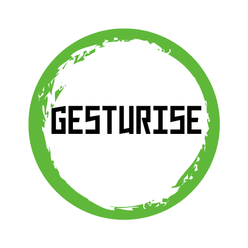

# Gesturize

## Hand Gesture Recognition and Control System

Gesturize is an innovative application that enables computer control through hand gestures captured via webcam. Using advanced computer vision and machine learning techniques, the system recognizes and interprets various hand gestures to perform actions like cursor movement, clicking, scrolling, and keyboard shortcuts.



## Features

- **Real-time Hand Detection**: Utilizes MediaPipe for accurate hand landmark detection
- **Gesture Recognition**: Machine learning model trained to recognize multiple hand gestures
- **Computer Control**: Control cursor movement, clicks, scrolls, and keyboard shortcuts
- **Mobile App Interface**: React Native frontend for configuration and mobile use
- **Voice Recognition**: Activate gesture controls through voice commands
- **Presentation Mode**: Special mode optimized for presentations

## Supported Gestures

| Gesture | Action |
|---------|--------|
| Pointer | Control cursor position |
| Victory | Mouse click |
| OK | Scrolling (up/down based on hand movement) |
| Drag | Click and drag operations |
| Thumbs Up | Exit |
| Horn | Mission Control (macOS) or App overview (Windows/Linux) |
| Duck | Copy/Paste (based on hand orientation) |

## Technical Architecture

The system follows a pipeline architecture:
1. **Input - Webcam**: Capture RGB frames using OpenCV
2. **Hand Detection**: Process frames with MediaPipe to extract hand landmarks
3. **Gesture Classification**: TensorFlow-based keypoint classifier identifies gestures
4. **Action Execution**: PyAutoGUI performs corresponding system actions

## Requirements

### Python Backend
```
mediapipe>=0.10.2
opencv-python>=4.8.0
tensorflow>=2.13.0
pyautogui>=0.9.54
numpy>=1.24.3
```

### Mobile App
```
React Native
@react-navigation
expo
```

## Installation

### Python Backend
1. Clone this repository
2. Install dependencies: `pip install -r requirements.txt`
3. Run the application: `python main.py`

### Mobile App
1. Navigate to gesture-app-frontend directory
2. Install dependencies: `npm install`
3. Run the app: `npm start`

## Usage Instructions

1. Launch the application by running `python main.py`
2. Position your hand in front of the webcam
3. Use the supported gestures to control your computer:
   - Move your pointer finger to control the cursor
   - Make a victory sign to click
   - Use OK gesture and move hand up/down to scroll
   - Form a horn gesture to activate Mission Control/App overview
   - Show thumbs up to exit applications

## Mobile Application

The mobile app provides a user-friendly interface with the following screens:
- **Landing Screen**: Welcome screen with login/signup options
- **Home Screen**: Main navigation with options for:
  - Use Device as Camera
  - Group Presentation
  - Configure Settings
- **Camera Screen**: Access to the device camera for gesture recognition
- **Configuration Screen**: Customize gesture mappings and sensitivity

## Machine Learning Model

The gesture recognition system uses a TensorFlow-based keypoint classifier trained on hand landmark positions. The model achieves:
- 94% overall accuracy
- Excellent precision and recall scores across most gesture classes
- Real-time inference capabilities

## Future Development

- Expanded gesture library
- Customizable gesture-to-action mapping
- Multi-hand support
- Integration with smart home systems
- Improved accessibility features

## Credits

Developed by Team Gesturize

## License

MIT License